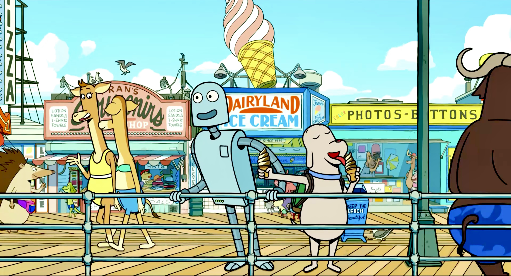

  <h2>Biography</h2>
  

    
I am Guojiao Lin (林国娇), a third-year graduate student at the Chinese Academy of Sciences. I obtained my Bachelor's degree in Software Engineering at Shandong University of Science and Technology.

    
    
During my undergraduate studies, I devoted a significant amount of time to learning programming, participating in professional competitions, focusing on academic writing, and deeply reflecting on my true passions. This period laid a solid foundation for my journey into academic research.

    
    
Additionally, I am an avid enthusiast of Chinese classical dance, portrait photography, and long-distance running.

  

  <h2>Research Interests</h2>
  

    

    My research interests encompass <strong>Multimodal Large Language Models</strong> and <strong>Embodied Artificial Intelligence</strong>. I am particularly fascinated by the intersection of multimodal technology and robotics, especially in how these techniques can enhance robots’ perception capabilities in complex environments. The emergence of LLMs has revealed the potential for achieving true Embodied AI, which excites me greatly!
    

  

  
  

    
    
The image is from the movie <em>Robot Dreams</em>, one of my all-time favorite films. I look forward to the day when robots can achieve what is depicted in the movie.

  

